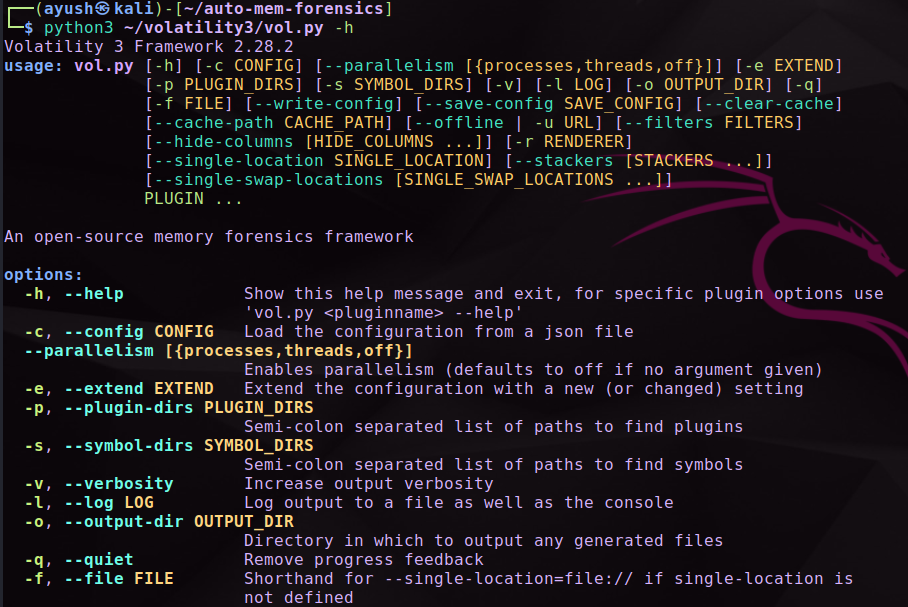
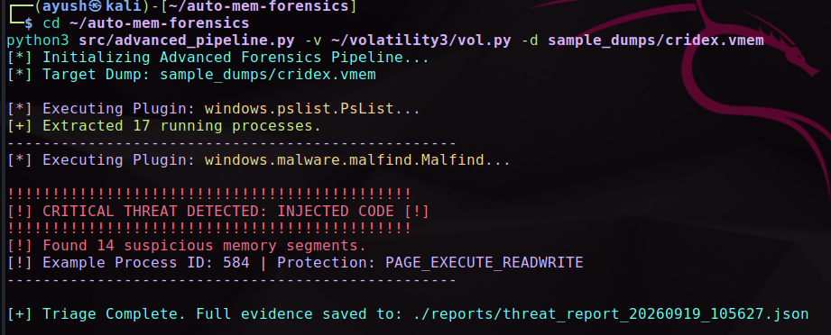
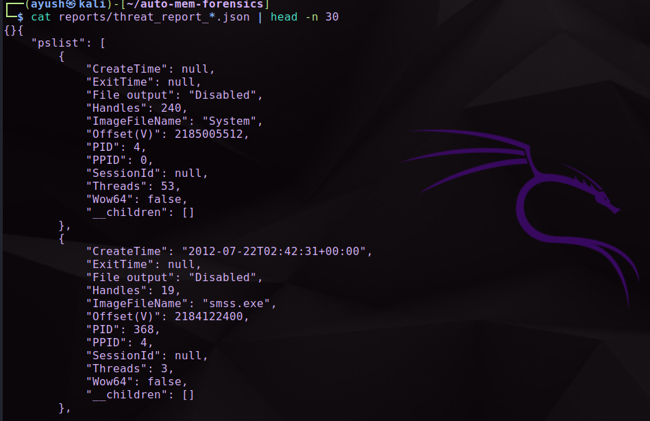

# 🧠 Automated Memory Forensics Pipeline


An automated triage tool built on top of the **[Volatility 3 Framework](https://github.com/volatilityfoundation/volatility3)**. This pipeline ingests a volatile memory dump (RAM image), automatically runs a curated set of Digital Forensics & Incident Response (DFIR) plugins against it, parses the raw output, and instantly flags signs of hidden rootkits and code-injected processes — turning a manual, multi-command investigation into a single automated run.

---

## 📖 Why Memory Forensics?

When a system is compromised, disk artifacts (files, logs) can be wiped, timestomped, or simply never written to disk at all — fileless malware, for example, lives entirely in RAM. **Memory forensics** captures a live snapshot of everything a system was doing at the moment of acquisition: running processes, injected code, network connections, and more. This makes it one of the most reliable ways to catch an active or recent compromise that disk-based analysis alone would miss.

This project focuses on two of the most common early triage questions an incident responder asks of a memory image:

1. **What processes were running, and do any of them look suspicious?** → `windows.pslist`
2. **Is there injected or hidden code masquerading as a legitimate process?** → `windows.malfind`

---

## 🚀 Features

- **Rapid Triage** — Automates execution of key Volatility 3 plugins (`windows.pslist`, `windows.malfind`) against a raw memory dump, removing the need to remember and chain individual Volatility commands by hand.
- **Smart Detection** — Parses each plugin's JSON output in real time and immediately flags injected memory regions (e.g. pages marked `PAGE_EXECUTE_READWRITE` with no backing file) alongside the owning Process ID.
- **Structured Evidence** — Generates a timestamped JSON report from every run (`threat_report_<timestamp>.json`), formatted for direct ingestion into a SIEM or case-management system, so findings aren't just printed to a terminal and lost.

---

## 🧩 How It Works (Pipeline Logic)

```
 ┌────────────────┐     ┌──────────────────────┐     ┌───────────────────┐
 │  Memory Dump    │────▶│  Volatility 3 Engine  │────▶│  Plugin Execution  │
 │  (.vmem/.raw)   │     │  (vol.py)             │     │  pslist / malfind  │
 └────────────────┘     └──────────────────────┘     └─────────┬──────────┘
                                                                  │ raw JSON output
                                                                  ▼
                                                        ┌───────────────────┐
                                                        │  Parser / Analyzer │
                                                        │  (PID cross-check, │
                                                        │  anomaly rules)    │
                                                        └─────────┬──────────┘
                                                                  │
                                          ┌───────────────────────┴──────────────────────┐
                                          ▼                                               ▼
                                ┌───────────────────┐                         ┌───────────────────────┐
                                │ 🔴 Terminal Alert   │                         │ 📄 Timestamped JSON    │
                                │ (anomaly detected)  │                         │ Report (SIEM-ready)    │
                                └───────────────────┘                         └───────────────────────┘
```

**Step by step, what the pipeline actually does:**

1. **Takes a memory image as input** — a `.vmem`, `.raw`, or similar dump captured from a suspect (usually Windows) machine.
2. **Invokes Volatility 3 programmatically** — instead of the analyst typing `vol.py -f dump.vmem windows.pslist` and `windows.malfind` as two separate commands, the pipeline calls both plugins back-to-back against the same image.
3. **Captures each plugin's output as structured JSON** — Volatility 3 supports a JSON output renderer, which is what makes automated parsing possible (versus scraping human-readable table output).
4. **Cross-references and scores the results** — `windows.pslist` gives the full process tree (PID, PPID, process name, handle count, thread count, create time), while `windows.malfind` flags memory regions with suspicious characteristics — most notably pages marked **`PAGE_EXECUTE_READWRITE`**, a classic code-injection signature, since legitimate code rarely needs to be both writable and executable at once. The pipeline correlates each malfind hit back to its owning PID from the pslist output.
5. **Raises a real-time alert** — the moment a suspicious memory segment is found, the pipeline prints an immediate red `CRITICAL THREAT DETECTED` alert to the terminal, showing the count of suspicious segments and an example offending PID, so the analyst doesn't have to wait for a full report to notice.
6. **Writes a timestamped JSON report** — every run's findings are serialized to `./reports/threat_report_<timestamp>.json`, so each triage pass is preserved as its own piece of evidence and can be fed straight into a SIEM, TIP, or case file.

---

## 📸 Demonstration

### 1. Volatility 3 Engine Setup

*Volatility 3 Framework 2.28.2 correctly installed and responding — confirming the engine is ready before the pipeline is pointed at a real memory dump.*

### 2. Automated Threat Detection (Red Alert)

*A live run against a sample dump (`cridex.vmem`). The pipeline extracts 17 running processes via `windows.pslist`, then `windows.malfind` flags 14 suspicious memory segments — including a `PAGE_EXECUTE_READWRITE` region on PID 584 — triggering an immediate `CRITICAL THREAT DETECTED` alert.*

### 3. Structured JSON Evidence Generation

*The corresponding timestamped JSON report, containing the full `pslist` process tree (PID, PPID, handles, threads, create time) — structured and ready for SIEM ingestion or case documentation.*

> **Note:** `cridex.vmem` is a well-known, publicly available malware memory sample (Cridex banking trojan) commonly used to test and demonstrate memory forensics tooling — no real or sensitive system was involved in this demonstration.

---

## ⚙️ Prerequisites

- Python 3.8+
- [Volatility 3](https://github.com/volatilityfoundation/volatility3) cloned and configured (tested on Kali Linux)
- A memory dump to analyze (e.g. captured with tools like FTK Imager, DumpIt, or `avml` — or a public sample such as `cridex.vmem` for testing)

## 📦 Installation

```bash
# Clone this repository
git clone https://github.com/ayushkp930/Advanced-SOC-and-Threat-Detection.git
cd Advanced-SOC-and-Threat-Detection/MemForensics-Automator

# (Recommended) create a virtual environment
python3 -m venv venv
source venv/bin/activate

# Install Python dependencies
pip install -r requirements.txt
```

## 💻 Usage

```bash
# Execute the pipeline against a suspect memory dump
python3 src/advanced_pipeline.py -v ~/volatility3/vol.py -d sample_dumps/cridex.vmem
```

**Arguments:**

| Flag | Description |
|---|---|
| `-v` | Path to your local Volatility 3 `vol.py` entry point |
| `-d` | Path to the memory dump file to analyze |

**On completion, the pipeline will:**
- Print any real-time anomaly alerts directly to the terminal (e.g. `CRITICAL THREAT DETECTED: INJECTED CODE`).
- Save a full, timestamped JSON report of all findings to `./reports/threat_report_<timestamp>.json`.

---

## 🗺️ Project Structure

```
MemForensics-Automator/
├── src/
│   └── advanced_pipeline.py   # Main automation & detection logic
├── sample_dumps/               # Test memory images (e.g. cridex.vmem)
├── images/                     # README demonstration screenshots
├── reports/                    # Generated timestamped JSON output (created at runtime)
└── README.md
```

---

## 🔭 Roadmap / Possible Extensions

- Add more Volatility 3 plugins to the pipeline (`windows.netscan`, `windows.dlllist`, `windows.handles`) for broader triage coverage.
- Add a scoring/severity system so findings can be ranked instead of treated as flat alerts.
- Export findings directly to a SIEM via API instead of a local JSON file.
- Add Linux (`linux.pslist`, `linux.malfind`) and macOS profile support for cross-platform triage.

---

## 🏆 Key Takeaways

- **Memory doesn't lie the way disk can** — fileless and in-memory-only threats are only visible through RAM analysis, making this a core DFIR skill.
- **`PAGE_EXECUTE_READWRITE` is a reliable red flag** — legitimate processes rarely need memory that is simultaneously writable and executable; malfind uses exactly this property to surface injected code.
- **Automation turns a manual, multi-step Volatility workflow into a repeatable pipeline** — critical when triaging multiple hosts during an incident.
- **Structured (JSON) output is what makes a forensic tool "SIEM-ready"** — human-readable tables are fine for a single analyst, but pipelines need machine-readable evidence.

## 📚 References

- [Volatility 3 Framework (GitHub)](https://github.com/volatilityfoundation/volatility3)
- [Volatility 3 Plugin Documentation](https://volatility3.readthedocs.io/)
- [SANS: Memory Forensics Cheat Sheet](https://www.sans.org/posters/memory-forensics-cheat-sheet/)

---

## 👨‍💻 Author

**Ayush Kumar Patel**
BCA in Cloud Security | Cybersecurity Enthusiast

*This project is part of an ongoing hands-on cybersecurity / DFIR portfolio.*
