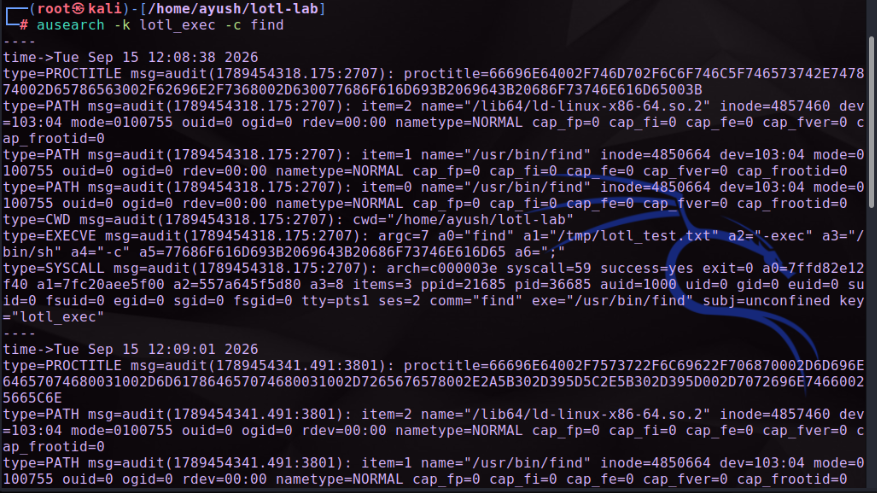
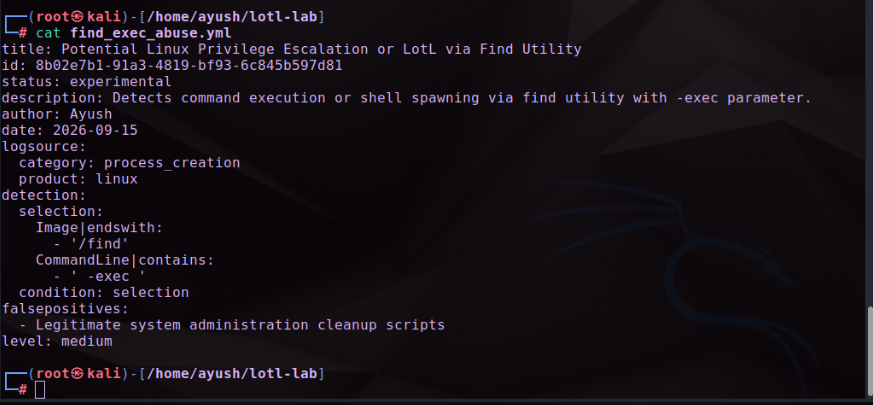
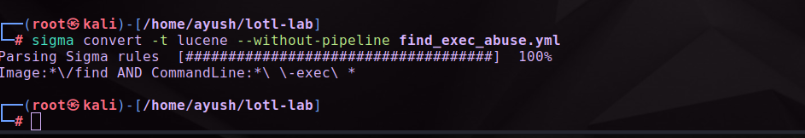
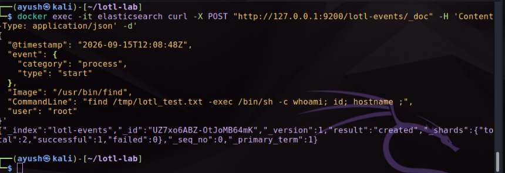
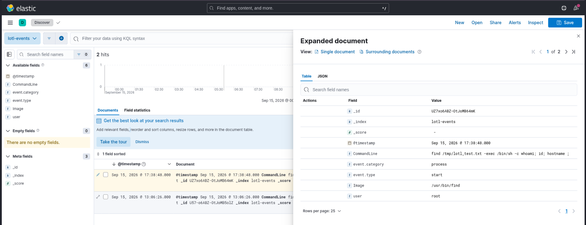

# 🛡️ SOC Home Lab: Living off the Land (LotL) Attack & Detection Engineering


## 📖 Project Overview

This project is a hands-on Security Operations Center (SOC) lab that walks through the **full detection engineering lifecycle** — from simulating a real attack technique to catching it in a SIEM.

It demonstrates a **"Living off the Land" (LotL)** attack, where an adversary abuses a trusted, pre-installed system binary (`find`) instead of dropping malware, in order to spawn a shell and evade simple antivirus/signature detection. The lab captures the kernel-level telemetry of that attack, translates the detection logic into a vendor-agnostic **Sigma rule**, converts it into a native SIEM query, and validates the whole pipeline by hunting the event down in **Kibana**.

This README is written so that someone with little to no prior SOC experience can follow the same steps and understand *why* each one matters, not just *what* command to type.

---

## 🎯 What This Lab Demonstrates

| Skill Area | What Was Done |
|---|---|
| **Telemetry Engineering** | Configured `auditd` to log every process execution (`execve`) at the kernel level |
| **Adversary Simulation** | Abused the `find` binary (a documented [GTFOBins](https://gtfobins.github.io/) technique) to spawn an unauthorized shell |
| **Threat Hunting** | Used `ausearch` to pull and interpret raw kernel audit telemetry |
| **Detection Engineering** | Authored a custom, reusable detection rule in the **Sigma** format |
| **SIEM Interoperability** | Compiled the Sigma rule into a native **Lucene** query using `sigma-cli` |
| **SIEM Validation** | Ingested the event into a Dockerized **Elasticsearch** index and hunted it down in **Kibana Discover** |

---

## 🛠️ Architecture & Tech Stack

- **Operating System:** Kali Linux
- **Telemetry Source:** `auditd` (Linux Audit Daemon)
- **Attack Technique:** `find -exec` privilege/shell abuse (GTFOBins)
- **Detection Format:** [Sigma](https://github.com/SigmaHQ/sigma) — vendor-agnostic detection-as-code
- **Rule Conversion:** `sigma-cli` with the Elasticsearch/Lucene backend
- **SIEM:** Dockerized ELK Stack — Elasticsearch + Kibana `8.11.0`

```
 ┌────────────┐    execve      ┌───────────┐    ausearch     ┌──────────────┐
 │  find -exec │ ───────────▶ │  auditd    │ ───────────────▶ │  Analyst      │
 │  (attack)   │   syscall     │ (telemetry)│    raw logs      │  investigates │
 └────────────┘                └───────────┘                  └──────┬───────┘
                                                                       │ writes
                                                                       ▼
                                                               ┌───────────────┐
                                                               │  Sigma Rule    │
                                                               │ (detection-as- │
                                                               │     code)      │
                                                               └──────┬────────┘
                                                                      │ sigma convert
                                                                      ▼
                                                               ┌───────────────┐
                                                               │ Lucene Query   │
                                                               └──────┬────────┘
                                                                      │ ingest + search
                                                                      ▼
                                                               ┌───────────────┐
                                                               │ Kibana Discover│
                                                               │ (2 hits found) │
                                                               └───────────────┘
```

---

## 🚀 Step-by-Step Walkthrough

### Step 1 — Configure Endpoint Telemetry (`auditd`)

Before any attack can be detected, the system needs **visibility**. `auditd` is the Linux kernel's native auditing subsystem — it can be told to log specific system calls as they happen.

```bash
# Log every 64-bit process execution (execve) and tag it with the key 'lotl_exec'
sudo auditctl -a always,exit -F arch=b64 -S execve -k lotl_exec

# Confirm the rule is active
sudo auditctl -l
```

**Why this matters:** `execve` is the syscall the kernel uses whenever *any* new process is launched. Watching it means nothing can run on the box without leaving a trace tagged `lotl_exec`, which we can search for later.

---

### Step 2 — Simulate the Adversary (LotL Attack)

Attackers frequently avoid dropping custom malware because it's easy for antivirus/EDR to flag. Instead, they abuse **binaries that are already trusted and installed on the system** — a technique catalogued at [GTFOBins](https://gtfobins.github.io/). Here, the `find` command's `-exec` flag is abused to spawn an arbitrary shell.

```bash
# Create a dummy target file
touch /tmp/lotl_test.txt

# Abuse find's -exec flag to spawn a shell and run commands
find /tmp/lotl_test.txt -exec /bin/sh -c 'whoami; id; hostname' \;
```

**Why this matters:** `find` is a completely legitimate, pre-installed utility — nothing about running it looks unusual on the surface. Its `-exec` parameter, however, lets it launch *any* other program, including a shell. This is exactly the kind of "living off the land" behavior a mature SOC needs to catch.

---

### Step 3 — Raw Log Analysis & Threat Hunting

With telemetry flowing, we now act as a SOC analyst hunting for evidence of the attack in the raw audit trail.

```bash
sudo ausearch -k lotl_exec -c find
```

**Why this matters:** This surfaces the exact kernel-level record of the execution — arguments (`a0="find"`, `a2="-exec"`, `a3="/bin/sh"`), the process ID, the parent process, and success/exit codes. It proves our telemetry pipeline is capturing the attack in enough detail to build a detection rule from.


*`ausearch` output — the kernel-level record of the `find -exec /bin/sh` execution, including full command-line arguments and process metadata.*

---

### Step 4 — Detection Engineering with Sigma

Rather than hand-writing a query tied to one specific SIEM, we author the detection logic once, in the **Sigma** format. Sigma rules are plain YAML and can be compiled into the native query language of almost any SIEM (Splunk, Elastic, QRadar, Microsoft Sentinel, etc.) — which makes the detection portable and shareable across teams and tools.

Create `find_exec_abuse.yml`:

```yaml
title: Potential Linux Privilege Escalation or LotL via Find Utility
id: 8b02e7b1-91a3-4819-bf93-6c845b597d81
status: experimental
description: Detects command execution or shell spawning via find utility with -exec parameter.
author: Ayush
date: 2026-09-15
logsource:
  category: process_creation
  product: linux
detection:
  selection:
    Image|endswith:
      - '/find'
    CommandLine|contains:
      - ' -exec '
  condition: selection
falsepositives:
  - Legitimate system administration cleanup scripts
level: medium
```

**Why this matters:** This is the reusable "detection-as-code" artifact of the project. Anyone — in any SOC, on any SIEM — can take this exact YAML file and generate a working detection for their own environment.


*The custom Sigma rule (`find_exec_abuse.yml`) — vendor-agnostic detection logic targeting the `find -exec` abuse pattern.*

---

### Step 5 — Convert the Rule for the SIEM (Sigma → Lucene)

`sigma-cli` compiles the generic Sigma rule into the query language a specific backend understands — in this case, Elasticsearch's **Lucene** syntax.

```bash
sigma convert -t lucene --without-pipeline find_exec_abuse.yml
```

**Generated query:**
```
Image:*\/find AND CommandLine:*\ \-exec\ *
```

**Why this matters:** This single command bridges the gap between "detection logic" and "something a SIEM can actually run." It's the same principle that lets a security team write one rule and deploy it across multiple SIEM platforms without rewriting the logic each time.


*`sigma-cli` converting the Sigma rule into an Elasticsearch-compatible Lucene query.*

---

### Step 6 — Ingest Telemetry into the SIEM

To validate the rule end-to-end, the captured event is pushed into a Dockerized Elasticsearch instance, simulating how telemetry would normally be shipped from an endpoint agent into a real SIEM pipeline.

```bash
docker exec -it elasticsearch curl -X POST "http://127.0.0.1:9200/lotl-events/_doc" \
  -H 'Content-Type: application/json' -d'
{
  "@timestamp": "2026-09-15T12:08:48Z",
  "event": { "category": "process", "type": "start" },
  "Image": "/usr/bin/find",
  "CommandLine": "find /tmp/lotl_test.txt -exec /bin/sh -c whoami; id; hostname ;",
  "user": "root"
}'
```

A `"result":"created"` response confirms the event now exists inside the `lotl-events` index, ready to be queried.


*Simulated telemetry successfully ingested into the Elasticsearch `lotl-events` index (`"result":"created"`).*

---

### Step 7 — Validate the Detection in Kibana

Finally, we bring everything together: a Data View is created for the `lotl-events` index in Kibana, and the Sigma-generated Lucene query is run inside **Discover** to hunt for the attack.

```
Image:*find AND CommandLine:*-exec*
```

**Result:** The query successfully surfaces the malicious `find -exec` execution among the indexed events, proving that the detection rule — written once in Sigma, compiled to Lucene, and deployed in Kibana — correctly catches the simulated attack.


*Kibana Discover — the Sigma-derived query matches the simulated attack, confirming the full detection pipeline works end to end.*

---

## 🏆 Key Takeaways

- **Visibility is everything.** Without `auditd` capturing `execve` syscalls, this LotL attack would have left zero trace.
- **Trusted binaries can be weapons.** Utilities like `find`, `awk`, and `tar` are legitimate system tools that can also be abused to spawn shells — a defender has to account for this, not just for known malware signatures.
- **Sigma decouples detection logic from any one SIEM.** Writing rules in Sigma means the same detection can be deployed across multiple platforms without being rewritten from scratch.
- **Detection engineering is a full pipeline**, not a single query: telemetry → hunting → rule authoring → rule conversion → SIEM validation.

## 📚 References

- [GTFOBins — find](https://gtfobins.github.io/gtfobins/find/)
- [Sigma Project (SigmaHQ)](https://github.com/SigmaHQ/sigma)
- [Linux auditd documentation](https://man7.org/linux/man-pages/man8/auditd.8.html)
- [Elastic Kibana Discover documentation](https://www.elastic.co/guide/en/kibana/current/discover.html)

---

*This lab was built as a self-directed SOC / detection engineering exercise to practice the full lifecycle of turning an attack simulation into a working, portable detection rule.*
